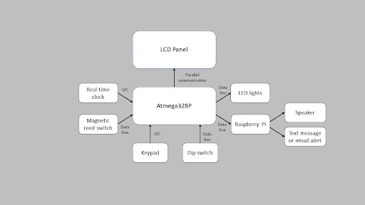
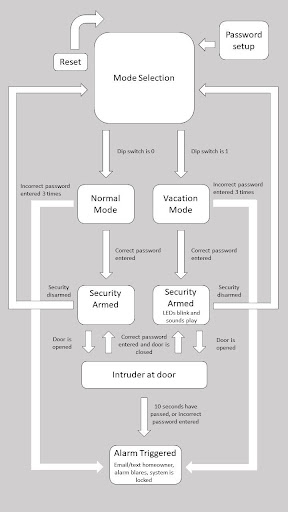

# TYK Security 

**Spring2024:** Ty Majam, Yaoyue Wang, Kelvin Cao,

#Problem Statement 
Robberies within the United States have been consistent throughout the past few decades. According to CNBC, ⅔ of home invasions happen when the family is on vacation as appliances such as lights or TV are silent for consecutive days, hinting to the thieves that no one is home.

## Project Overview 

To combat this issue, we propose a smart home security system with two modes: Normal Mode and Vacation Mode. Unlike certain modern-day security systems that are limited to motion detection, our security system will solve the problem of thieves taking advantage of families that are on vacation. 
* **Normal Mode:** For everyday use where the security system can lock down the house to prevent robberies from happening. It can detect if a door is opened and then sound an alarm and notify the homeowner if the security is not disabled.
* **Vacation Mode:** Simulates activity by turning lights on/off and playing household sounds to give the illusion that someone is home, in addition to the usual security features.

Below is a block diagram of our circuit: 

## Hardware and Connections

The system utilizes an Atmega328P microcontroller to manage all components. I2C communication is used between the microcontroller, RTC, and keypad for efficient data exchange. Direction connections from data lines are used for the Raspberry Pi, LED lights, and the magnetic reed switch. Lastly, the LCD panel uses parallel communication.

Key hardware elements:
* I2C Keypad (Input): Used to set and enter a passcode for arming/disarming the system
* DIP switch (Input): Allows switching between between normal and vacation mode
* Magnetic reed switch (Input): Detects if the door is opened or closed
* Real-time clock (RTC) (Input): Provides time to manage the modes 
* LCD panel (Output): Displays current time, system mode, system messages, countdown for the alarm, and flashes warning messages when incorrect passwords are entered
* Raspberry Pi 4 (Output): Sends notifications (texts/emails) and plays sound through a connected speaker
* LEDs (Output): Simulates room occupancy or flashes when alarm is triggered
* Speaker (Output): Plays common household sounds and alarm sound when intruder is detected

## Pin Connections 
The microcontroller was used to interface all our hardware and software together. Below are the pin connections that we used. The connections marked with 🔴 must be placed in that specific pin while the other pins are flexible. 

| ATMEGA 1-14    | Connection             | ATMEGA 15-28    | Connection         |
|----------------|------------------------|-----------------|--------------------|
| 1              | Resistor               | 28 (SCL)        | 🔴 Resistor         |
| 2              | Dip Switch 1           | 27 (SDA)        | 🔴 Resistor         |
| 3              | Dip Switch 2           | 26              | Alarm Sound         |
| 4              | Magnetic Reed Switch   | 25              | Mix of sounds       |
| 5              | LED Alarm              | 24              | LED Room 1          |
| 6 (PD4)        | LCD Pin 11             | 23              | 🔴 Resistor         |
| 7              | Power                  | 22              | GND                 |
| 8              | GND                    | 21              | Open                |
| 9              | SG51P                  | 20              | Open                |
| 10             | Open                   | 19              | 🔴 6 pin header      |
| 11 (PD5)       | LCD Pin 12             | 18              | 🔴 6 pin header      |
| 12 (PD6)       | LCD Pin 13             | 17              | 🔴 6 pin header      |
| 13 (PD7)       | LCD Pin 14             | 16 (PB2) enable | LCD Pin 6           |
| 14             | LED Room 2             | 15 (RS)         | LCD Pin 4           |

## Software 

Our software employs a state machine design to handle the system logic and user interactions. 
Below is our state machine diagram:

* **Initial setup:** The user sets the current date and time on the RTC using the keypad and the LCD panel. The time is then updated indefinitely and does not need to be set again.
*  **Passcode Setup:** The user creates a passcode using the I2C keypad which is used to arm and disarm the system. The code currently is 4 digits long as set by the code but it can be changed to be 32 digits long. 
*  **ISR:** The ISR will update the time on the LCD panel to prevent blocking in the system.
*  **Main Logic:**: The main logic is an infinite loop that detects changes of mode (dip switch), keypad presses, security breaches (door or incorrect password), and the state of security. It also sends signals to the Raspberry Pi for sound, LEDs, and the LCD panel. 
*  **Raspberry Pi Logic:** The Pi will loop through random household noises during vacation mode and will play an alarm sound when security is breached. It also has a startup sound.

# How to Operate the System 

1. Correctly wire and solder all components to the microcontroller
2. Set up the Raspberry Pi and wire it to the microcontroller and speaker
3. Power on the system by connecting the microcontroller to power
4. Initialize the system by entering a 4-digit passcode
5. Switch between the modes using the dip switch, and arm/disarm the system by entering the passcode (make sure to disarm the system before trying to switch modes) 

## Parts List and Cost

| Part Name                        | Cost     |
|-----------------------------------|----------|
| Adafruit 499 (LCD)                | $44.95   |
| Sparkfun COM-15290 (Keypad)       | $11.50   |
| 4 Position DIP switch             | $0.64    |
| Sparkfun BOB-12708 (Timer)        | $17.50   |
| Adafruit 375 (Reed Switch)        | $3.95    |
| Raspberry Pi 4                    | $49.95   |
| LED lights                        | $0.50    |
| Speaker with 3.5mm aux input jack | $12.80   |
| Wires, female-to-female connectors, solder | $5.00 |

**Total cost: $146.79**
